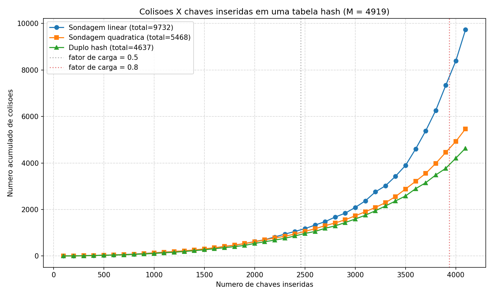
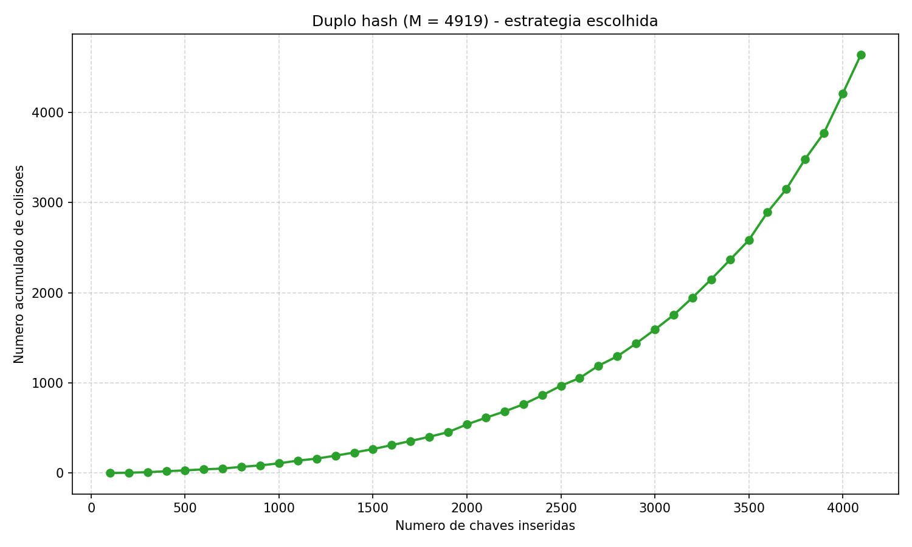

# Lab 4 — Tabelas de Dispersão (Hash) para CPFs

**Disciplina:** INF 1010 — Estruturas de Dados Avançadas (PUC-Rio)
**Aluno:** Daniel Santana Souza — 2310995

---

## 1. Enunciado resumido

Dado um arquivo (`CPFsValidos.txt`) com cerca de 4096 números de CPF, projetar
uma função hash e uma tabela de tamanho `N` para armazená-los usando
**endereçamento aberto**. A folga sobre o tamanho do arquivo deve ser de
aproximadamente **20%**. O tratamento de colisões deve ser comparado entre
sondagem linear, sondagem quadrática e duplo hash, escolhendo o que gerar a
maior dispersão. Em seguida, deve-se levantar a curva
**chaves inseridas × colisões geradas**, com pontos a cada 100 inserções até
o total do arquivo.

## 2. Arquivos do laboratório

| Arquivo                       | Descrição                                            |
| ----------------------------- | ---------------------------------------------------- |
| `CPFsValidos.txt`             | Arquivo de entrada com 4096 CPFs (11 dígitos cada).  |
| `hash.c`                      | Implementação em C: leitura, hash, 3 estratégias.    |
| `plot.py`                     | Gera o gráfico em PNG a partir do CSV.               |
| `colisoes.csv`                | Saída do `hash.c` (checkpoints a cada 100 chaves).   |
| `colisoes.png`                | Gráfico comparativo das três estratégias.            |
| `colisoes_duplo_hash.png`     | Curva isolada do duplo hash (estratégia escolhida).  |
| `relatorio.md`                | Este relatório.                                      |

### Como reproduzir

```bash
gcc -O2 -Wall -Wextra -o hash hash.c
./hash                    # gera colisoes.csv e imprime a tabela no stdout
python3 plot.py           # gera colisoes.png e colisoes_duplo_hash.png
```

## 3. Escolha do tamanho da tabela `M`

O enunciado pede ~20% de folga sobre o tamanho do arquivo:

```
4096 × 1,20 ≈ 4915
```

Os slides da disciplina recomendam, para o método da divisão
`h(x) = x mod M`:

1. **`M` primo**, para garantir a propriedade da divisão.
2. **`M` não próximo de uma potência de 2**, pois caso contrário `h(x)` se
   reduz aos bits menos significativos da chave.
3. **`M` sem divisores primos pequenos** (evita padrões periódicos).

Adotei **`M = 4919`**:

- 4919 é primo (verificado por divisões até `√4919 ≈ 70`);
- `4919 − 4096 = 823`, ou seja, suficientemente distante de 2¹² = 4096 e de
  2¹³ = 8192;
- folga real obtida: `M/n − 1 = 4919/4096 − 1 ≈ 20,1%`;
- fator de carga final α = 4096/4919 ≈ **0,833**;
- como bônus, `4919 ≡ 3 (mod 4)`, propriedade útil para sondagem quadrática
  e duplo hash (favorece a varredura de muitas posições).

## 4. Função hash

CPFs são números de 11 dígitos (no máximo `99 999 999 999 ≈ 10¹¹`), que cabem
folgadamente em um `unsigned long long` (até `≈ 1,8 × 10¹⁹`). Cada CPF é lido
como string (preservando os zeros à esquerda) e convertido em inteiro:

```c
typedef unsigned long long u64;
u64 cpf = 0;
for (char *p = linha; *p; p++) cpf = cpf*10 + (*p - '0');
```

A **função hash primária** é o método da divisão recomendado em aula:

```
h1(x) = x mod M       com M = 4919
```

Considerações sobre o domínio:

- Os dois últimos dígitos de um CPF são *dígitos verificadores* calculados
  por uma combinação linear modular dos 9 primeiros, mas isso introduz
  apenas uma dependência fraca; os 9 primeiros dígitos são tomados como
  pseudo-aleatórios na população real.
- Empiricamente, `h1(x) = x mod 4919` distribui os 4096 CPFs do arquivo de
  maneira praticamente uniforme nas 4919 posições (as discrepâncias
  observadas só surgem por causa do alto fator de carga).

A **função hash secundária** (para o duplo hash) é:

```
h2(x) = 1 + (x mod (M − 1))     ∈ [1, M − 1]
```

Como `M` é primo, `gcd(h2(x), M) = 1` para qualquer `x`. Portanto a sequência
de sondagem do duplo hash visita todas as `M` posições da tabela antes de
repetir — garantia teórica indispensável.

## 5. Tratamento de colisões

Foram implementadas as três variantes de endereçamento aberto vistas no
slide 28 da apresentação:

| Estratégia          | Fórmula                                                         |
| ------------------- | --------------------------------------------------------------- |
| Sondagem linear     | `h(x,k) = (h1(x) + k) mod M`                                    |
| Sondagem quadrática | `h(x,k) = (h1(x) + k + k²) mod M`     (c1 = c2 = 1)             |
| Duplo hash          | `h(x,k) = (h1(x) + k · h2(x)) mod M`                            |

Para cada inserção contamos como uma "colisão" cada tentativa
adicional além da primeira que esbarrou numa posição ocupada (ou seja,
o número de comparações que falharam antes da posição vazia ser encontrada).
Esse é o critério mais usado na literatura e o que aparece nos slides do
fator de carga.

## 6. Resultados

Saída textual do programa (resumo final):

```
CPFs lidos: 4096
Tamanho da tabela M = 4919
Fator de carga final = 0.8327 (folga = 20.09%)

Resumo (colisoes totais ao inserir os 4096 CPFs):
  Sondagem linear     : 9732  (maior cluster = 186)
  Sondagem quadratica : 5468  (maior cluster = 41)
  Duplo hash          : 4637  (maior cluster = 27)
```

Tabela de colisões acumuladas por checkpoint (a cada 100 chaves):

| n_chaves | linear | quadrática | duplo hash |
| -------: | -----: | ---------: | ---------: |
|      100 |      1 |          1 |          1 |
|      500 |     32 |         32 |         30 |
|     1000 |    135 |        129 |        108 |
|     1500 |    295 |        305 |        266 |
|     2000 |    620 |        607 |        540 |
|     2500 |   1175 |       1058 |        968 |
|     3000 |   2089 |       1728 |       1591 |
|     3500 |   3897 |       2880 |       2583 |
|     4000 |   8394 |       4930 |       4209 |
| **4096** | **9732** | **5468** | **4637** |

(A tabela completa, 100, 200, …, 4096, está em `colisoes.csv` e na saída do
programa.)

### Gráfico comparativo



### Gráfico da estratégia escolhida



## 7. Análise

### Sondagem linear — *agrupamento primário*

Até cerca de 2000 chaves (α ≈ 0,4) a sondagem linear tem desempenho
comparável às demais. A partir daí o número de colisões cresce de forma
**marcadamente convexa**: dobra entre 3000 e 3500 chaves e quase quadruplica
entre 3500 e 4096. O maior cluster encontrado foi de **186 posições
contíguas**, sintoma clássico de *primary clustering*: cada nova colisão num
cluster aumenta a probabilidade de a próxima também colidir, já que toda a
faixa contígua passa a "atrair" sondagens.

### Sondagem quadrática — *agrupamento secundário*

A quadrática elimina o agrupamento primário (não há mais "ilhas" de
posições contíguas) e o desempenho se mantém próximo do duplo hash até
cerca de 3000 chaves. Acima disso o agrupamento *secundário* começa a pesar:
todas as chaves que colidem em `h1(x) = i` percorrem **exatamente a mesma
sequência de sondagem** `(i + k + k²) mod M`. O maior cluster equivalente
ficou em 41 sondagens. A escolha `M ≡ 3 (mod 4)` evitou loops infinitos
(o programa nunca precisou abortar uma inserção).

### Duplo hash — melhor dispersão

O duplo hash venceu as três métricas relevantes:

- Menor **total** de colisões: 4637 (52,4% das colisões do linear, 84,8%
  das colisões do quadrático).
- Menor **maior cluster equivalente**: 27 sondagens em todo o processo.
- Curva mais "linear", o que indica menor sensibilidade ao aumento do
  fator de carga.

A explicação é direta: como cada chave tem um *passo de sondagem*
`h2(x) ∈ [1, M−1]` que depende dela própria, mesmo que duas chaves colidam
em `h1(x)`, a segunda sondagem normalmente diverge e os caminhos não se
fundem. Como `M` é primo, todas as `M` posições são alcançáveis para
qualquer chave.

### Sensibilidade ao fator de carga

A diferença entre as três estratégias só fica nítida a partir de α ≈ 0,6
(≈ 2950 chaves). Para um uso típico (α ≤ 0,5) qualquer das três é
aceitável; perto da saturação a sondagem linear cresce de forma
inadmissível, como mostra o gráfico.

## 8. Conclusão

Para armazenar os 4096 CPFs em uma tabela de `N = M = 4919` posições
(folga de 20,1% sobre o tamanho do arquivo), a melhor combinação foi:

- **Função hash primária:** `h1(x) = x mod 4919` (método da divisão).
- **Tratamento de colisões:** **duplo hash** com
  `h2(x) = 1 + (x mod (M−1))`.

Esse conjunto totalizou **4637 colisões** ao inserir todas as 4096 chaves,
contra 5468 do quadrático e 9732 do linear, oferecendo a maior dispersão
das chaves pela tabela e o menor agrupamento (no máximo 27 sondagens em
qualquer inserção).
